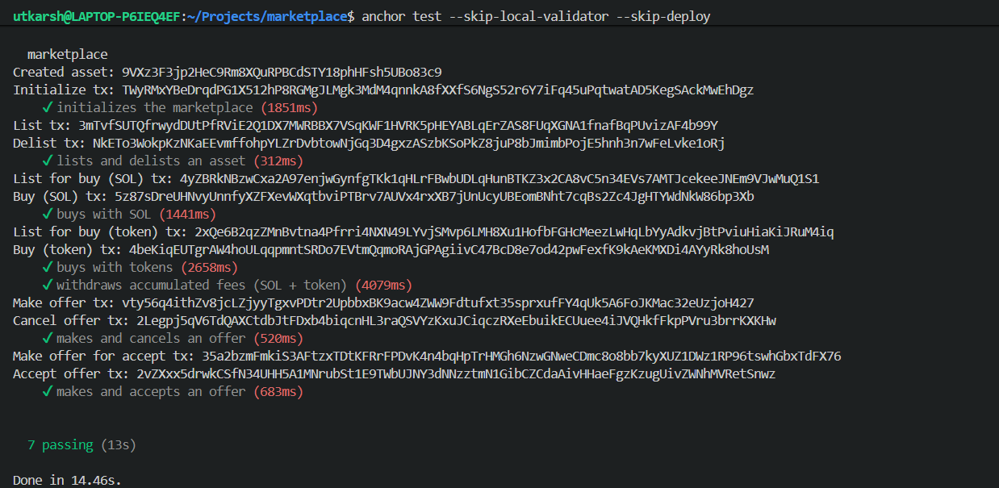

# Solana NFT Marketplace Program

This document is an instruction-first reference for the `marketplace` Anchor program. It focuses on the on-chain instruction surface, expected accounts/PDAs, important constraints, and common error conditions. For runtime or deployment details see the repository, but this README intentionally emphasizes program semantics and usage from a client or integrator perspective.

## Overview

The marketplace program provides a simple NFT marketplace with support for:
- Creating a named `Marketplace` (admin, fee basis points, treasury + reward PDAs)
- Listing NFTs for sale (with arbitrary SPL payment mints)
- Buying listings with SPL tokens (fee split + reward mint)
- Making and accepting offers (locked lamports vault)
- Withdrawing accumulated fees (SOL or SPL tokens)

## Accounts & PDAs (summary)

- `Marketplace` (PDA): seeds `["marketplace", name]`. Holds `admin: Pubkey`, `fee: u16` (basis points out of 10000), bumps for treasury and reward mint, and `name` (max 32 bytes).
- `Treasury` (PDA): seeds `["treasury", marketplace.key()]`. Holds SOL for fees.
- `Reward Mint` (mint PDA): seeds `["rewards", marketplace.key()]`. Mint authority is the `Marketplace` PDA; decimals = 6.
- `Listing` (PDA): seeds `["listing", asset_pubkey]`. Stores maker, asset, payment_mint, price, bump. Listing owns the NFT via mpl-core transfer.
- `Offer` (PDA): seeds `["offer", asset_pubkey, buyer_pubkey]`. Stores buyer, asset, amount, bump, vault_bump.
- `Offer Vault` (PDA / SystemAccount): seeds `["offer_vault", asset_pubkey, buyer_pubkey]`. Holds lamports for the offer.
- `Treasury Payment Account` (SPL token account PDA): seeds `["treasury", marketplace.key(), payment_mint]`. Holds SPL fee balances per mint.

## Instructions

Each instruction includes the accounts expected and any arguments. Brief summaries follow; consult the IDL for full types and Anchor-generated client helpers.

- Initialize
  - Purpose: Create a new `Marketplace` (admin, fee, name) and its reward mint.
  - Accounts: `admin: Signer`, `marketplace: init PDA`, `treasury: PDA`, `reward_mint: init PDA mint`, `token_program`, `system_program`.
  - Args: `name: String` (<= 32 bytes), `fee: u16` (<= 10000).
  - Notes: `reward_mint` is created with `decimals = 6` and authority = `marketplace` PDA.

- List (create listing)
  - Purpose: Transfer an NFT into a `Listing` PDA and create `Listing` metadata (price, payment mint).
  - Accounts: `maker: Signer`, `asset: UncheckedAccount` (validated by mpl-core CPI), optional `collection`, `payment_mint: Mint interface`, `listing: init PDA`, `mpl_core_program`, `token_program`, `system_program`.
  - Args: `price: u64`.
  - Notes: The listing transfers the asset into the `listing` PDA via an mpl-core CPI.

- Delist
  - Purpose: Return the NFT from `Listing` PDA to its `maker` and close the `Listing` account.
  - Accounts: `maker: Signer`, `listing: Account (mut, close = maker)`, `asset`, optional `collection`, `mpl_core_program`, `system_program`.
  - Validation: `maker` must equal `listing.maker` otherwise `Unauthorized` error.

- BuyWithToken
  - Purpose: Buy a `Listing` using SPL tokens, split fee to treasury, transfer net to maker, transfer NFT to taker, and mint rewards.
  - Accounts (high level): `taker: Signer`, `maker`, `asset`, optional `collection`, `marketplace: Marketplace PDA`, `listing: Listing PDA (mut, close = maker)`, `payment_mint`, `taker_payment_ata`, `maker_payment_ata`, `treasury_payment_account` (PDA token account), `reward_mint` (PDA mint), `taker_reward_ata`, `mpl_core_program`, `associated_token_program`, `token_program`, `system_program`.
  - Flow:
    1. Verify `listing.payment_mint == payment_mint` (error: `MintMismatch`).
    2. Compute fee: fee = price * marketplace.fee / 10000.
    3. Transfer `maker_amount = price - fee` to the maker's payment ATA via `transfer_checked`.
    4. Transfer `fee` to the marketplace's `treasury_payment_account`.
    5. Transfer NFT to taker via mpl-core CPI (signed by `listing` PDA seeds).
    6. Mint rewards: reward = price * 100 / 10000 (1% by default) to buyer's reward ATA. Reward mint has 6 decimals.

- MakeOffer
  - Purpose: Buyer posts an offer for an asset by locking lamports into an `offer_vault` PDA and creating an `Offer` account.
  - Accounts: `buyer: Signer`, `asset: UncheckedAccount`, `offer: init PDA`, `vault: SystemAccount (mut)`, `system_program`.
  - Args: `amount: u64` (must be > 0). Error: `InvalidOfferAmount` if zero.
  - Notes: Lamports are transferred from buyer into the vault PDA.

- AcceptOffer
  - Purpose: Maker accepts a posted offer — vault lamports are split (maker amount, fee to treasury, refund any remainder), NFT is transferred to buyer, and rewards minted to buyer.
  - Accounts: `maker: Signer`, `buyer: UncheckedAccount`, `asset: UncheckedAccount`, optional `collection`, `marketplace: Marketplace PDA`, `listing: Listing (mut, close=maker)`, `offer: Offer (mut, close=buyer)`, `vault: offer_vault PDA`, `treasury: SystemAccount (mut)`, `reward_mint` (PDA mint), `buyer_reward_ata`, `mpl_core_program`, `associated_token_program`, `token_program`, `system_program`.
  - Flow: Verify asset/offer match, compute fee, transfer maker_amount to maker (signed by vault PDA seeds), transfer fee to treasury, transfer NFT to buyer (signed by listing PDA seeds), mint 1% rewards to buyer.

- CancelOffer
  - Purpose: Buyer cancels their own offer and recovers lamports in the vault.
  - Accounts: `buyer: Signer`, `asset: UncheckedAccount`, `offer: Offer (mut, close=buyer)`, `vault: offer_vault PDA`, `system_program`.
  - Validation: only `offer.buyer` may cancel; vault lamports are returned to buyer.

- WithdrawFee
  - Purpose: Admin withdraws accumulated fees (SOL or SPL tokens) from treasury PDAs.
  - Accounts (SOL): `admin: Signer`, `marketplace: Marketplace PDA`, `treasury: SystemAccount (mut)`, `to: SystemAccount (mut)`, `system_program`.
  - Accounts (SPL): `payment_mint`, `treasury_payment_account: PDA token account`, `to_payment_ata`, `token_program`.
  - Validation: only `marketplace.admin` may withdraw (error: `UnauthorizedAdmin`).

## Error Conditions

The program defines the following Anchor errors (non-exhaustive):

- `InvalidFee` — fee must be <= 10000 (basis points).
- `InvalidName` — name must be <= 32 bytes.
- `Unauthorized` / `UnauthorizedAdmin` — permission checks for actions.
- `InvalidOfferAmount` — offer amount must be greater than zero.
- `UnauthorizedOfferCancellation` — only the buyer may cancel their offer.
- `OfferAssetMismatch` — asset mismatch between offer and listing.
- `MintMismatch` — payment mint provided must match the listing's payment mint.

## Integration Notes & Conventions

- Fee math: basis points (bps) with denominator 10000. For example, a fee of 250 is 2.5%.
- Reward mint: fixed decimals = 6 and minted by the marketplace PDA. Reward amount is calculated as `price * 100 / 10000` (1% of price).
- CPI to `mpl-core` (mpl_core::instructions::TransferV1CpiBuilder) is used to move NFTs into/out-of listing PDAs — clients MUST supply the optional `collection` account when applicable.
- Listing/offer PDAs are deterministic and derived from the asset pubkey (and buyer for offers). Use the IDL for exact PDA layouts and bumps.

---

Tests: a local test run screenshot is included here showing the current passing test suite.

